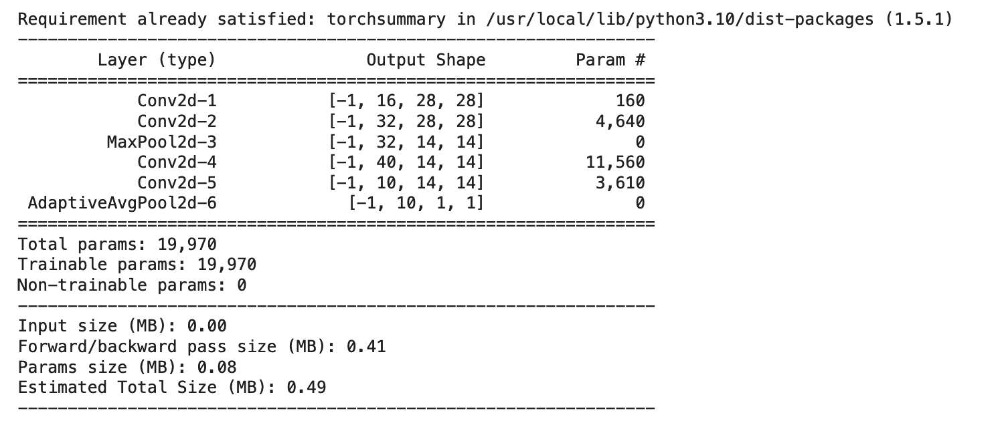
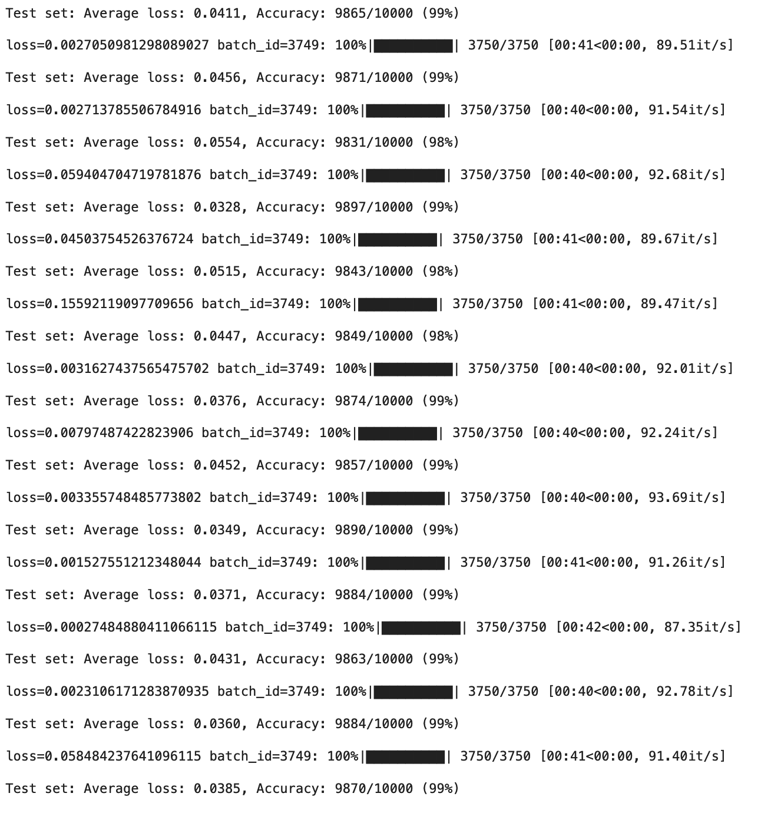

# Backpropagation and Advanced Architectures 

```
# MNIST Classification with PyTorch

This repository contains a simple implementation of MNIST digit classification using PyTorch. The code includes the following components:

1. `S6.ipynb`: The main script to train and test the MNIST classifier.
2. `model.py`: Defines the architecture of the neural network model.
3. `utils.py`: Contains utility functions for printing model summary.
4. `data.py`: Contains functions to load and preprocess the MNIST dataset.

## Requirements

- Python 3.x
- PyTorch
- torchvision
- tqdm

## Usage

1. Clone the repository:

```bash
git clone https://github.com/your_username/mnist-classification-pytorch.git
cd mnist-classification-pytorch
```

2. Install the required dependencies:

```bash
pip install torch torchvision tqdm
```

3. Train the model and test accuracy:

```
S6.ipynb
```

4. (Optional) Modify the hyperparameters and model architecture in `S6.ipynb` and `model.py` to experiment with different configurations.

## File Descriptions

- `S6.ipynb`: The main script to train and test the MNIST classifier.
- `model.py`: Defines the architecture of the neural network model.
- `utils.py`: Contains utility functions for printing model summary.
- `data.py`: Contains functions to load and preprocess the MNIST dataset.

## Citation

If you find this code useful in your research or work, please consider citing:

## Parameters



## Result 




```
@misc{Backpropagation and Advanced Architectures,
  author = {Ishwar Venugopal},
  title = {Backpropagation and Advanced Architectures },
  year = {2023},
  publisher = {GitHub},
  journal = {GitHub repository},
  Published = {\url{https://github.com/ishwarraja/SOAI-ERAV2/new/main/S6}},

}
```
