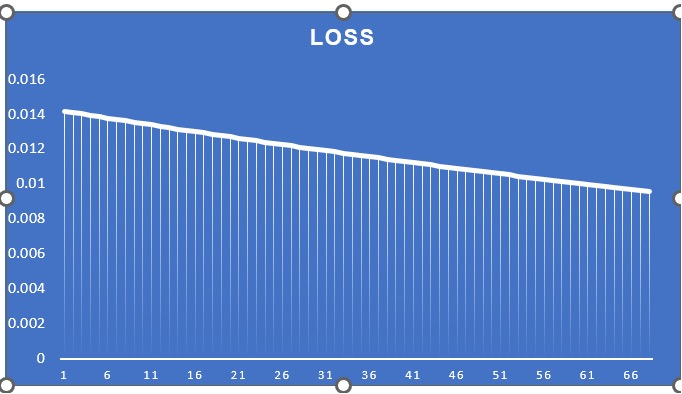
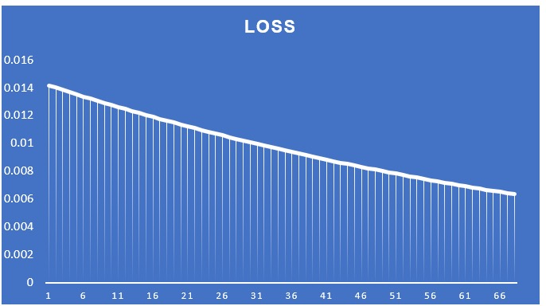
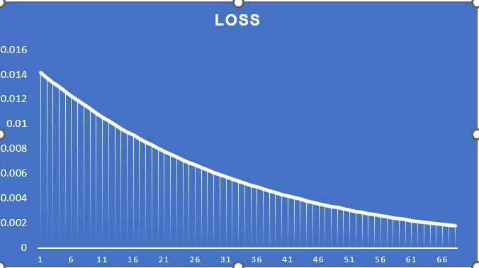
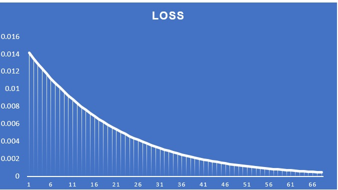
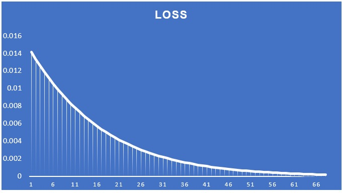
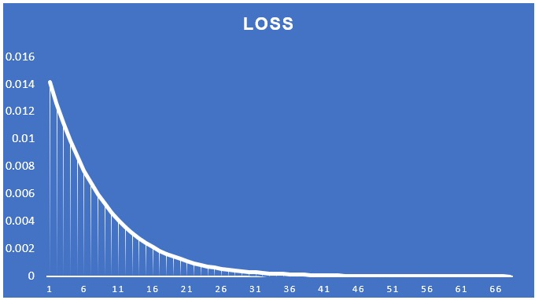

# Assignment 6: Part 1

## Learning Rate is 0.1
With learning rate 0.1, the loss decreased from 0.014 to 0.01 after 66 epochs

## Learning Rate is 0.2
With learning rate 0.2, the loss decreased from 0.014 to about 0.06 after 66 epochs

## Learning Rate is 0.5
With learning rate 0.5, the loss decreased from 0.014 to about 0.02 after 66 epochs

## Learning Rate is 0.8
With learning rate 0.8, the loss decreased from 0.014 to less than 0.02 after 66 epochs

## Learning Rate is 1.0
With learning rate 1.0, the loss decreased from 0.014 to less than 0.0 after 66 epochs

## Learning Rate is 2.0
With learning rate 2.0, the loss decreased from 0.014 to 0.0 in less than 36 epochs

## Summary:
As learning rate increases from 0.1 to 2.0, the loss decreases to 0 within 36 epochs.

