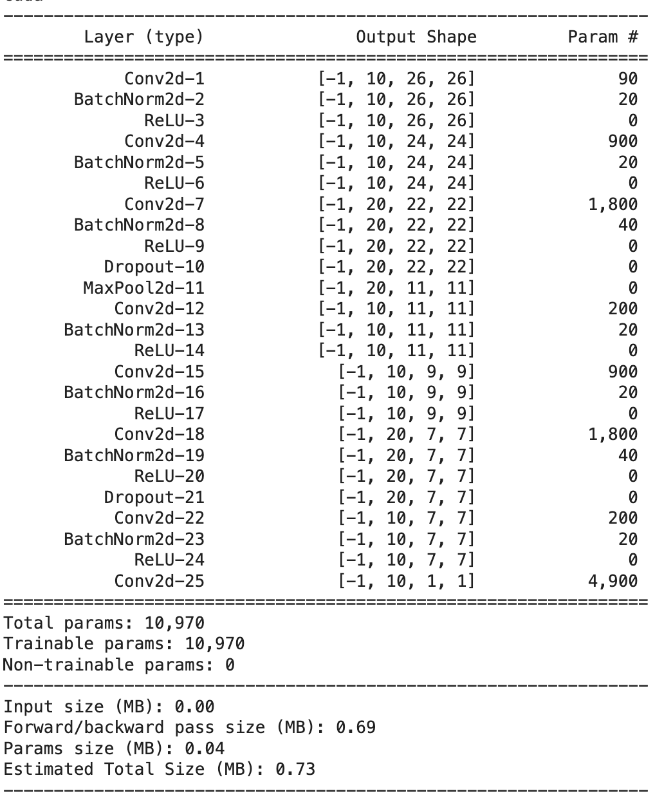
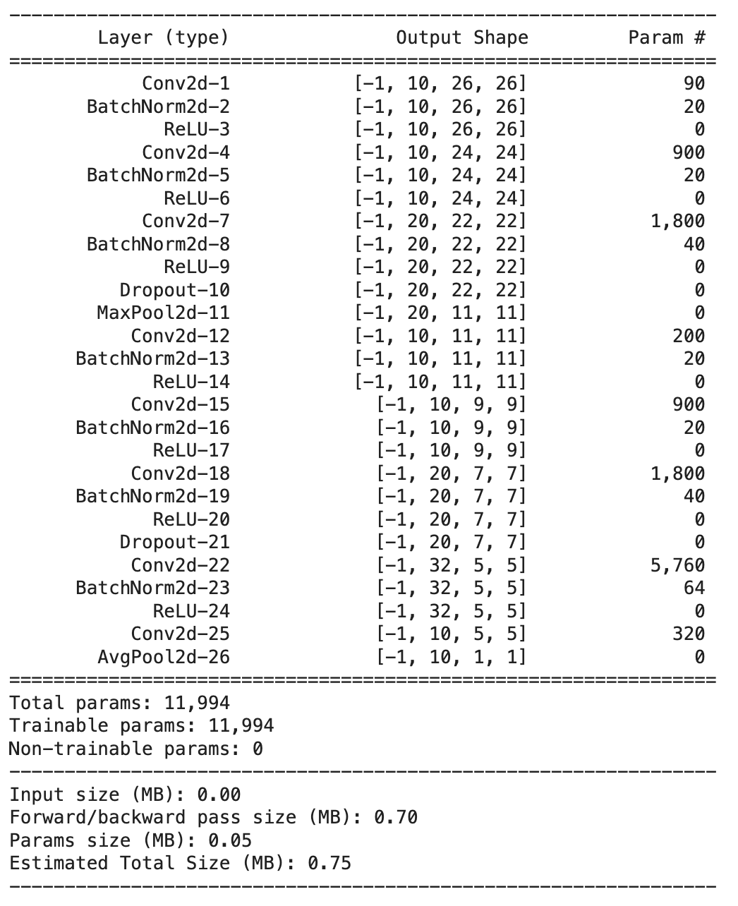

## Session 7 Assignment -
**********************************************************************************************************************
### Model1 Name - The Lighter Model
### Code Explanation

#### Target 
Make the model lighter

#### Results: 
1.Parameters : 10790

2.Train Accuracy : 99.11

3.Test Accuracy : 98.90
  
#### Analysis:
1.Good model!
  
2.No over-fitting
  
#### File Link: https://github.com/ishwarraja/SOAI-ERAV2/blob/main/S7/ERA1S7F3.ipynb

**********************************************************************************************************************
### Model2 Name - The Batch Normalization
### Code Explanation

#### Target 
Add Batch-norm to increase model efficiency.

#### Results: 
1.Parameters : 10970

2.Train Accuracy : 99.29

3.Test Accuracy : 99.04

#### Analysis:
Good model!

#### File Link: https://github.com/ishwarraja/SOAI-ERAV2/blob/main/S7/ERA1S7F5.ipynb

**********************************************************************************************************************
### Model3 Name - The Regularization
### Code Explanation

#### Target 
Add Regularization, Dropout

#### Results: 
1.Parameters : 10970

2.Train Accuracy : 99.29

3.Test Accuracy : 99.07

#### Analysis:
Regularization working. 
But with the current capacity, not possible to push it further. 
We are also not using GAP, but depending on a BIG-sized kernel

#### File Link: https://github.com/ishwarraja/SOAI-ERAV2/blob/main/S7/ERA1S7F5.ipynb

**********************************************************************************************************************
### Model4 Name -  Increase the Capicity
### Code Explanation

#### Target 
Increase model capacity. Add more layers at the end. 

#### Results: 
1.Parameters : 11994

2.Train Accuracy : 99.22

3.Test Accuracy : 98.04

#### Analysis:
The model still showing over-fitting, possibly DropOut is not working as expected! 

Wait yes! We don't know which layer is causing over-fitting. Adding it to a specific layer wasn't a great idea. Quite Possibly we need to add more capacity, especially at the end. 

Closer analysis of MNIST can also reveal that just at RF of 5x5 we start to see patterns forming. 

We can also increase the capacity of the model by adding a layer after GAP!

#### File Link: https://github.com/ishwarraja/SOAI-ERAV2/blob/main/S7/ERA1S7F7.ipynb

