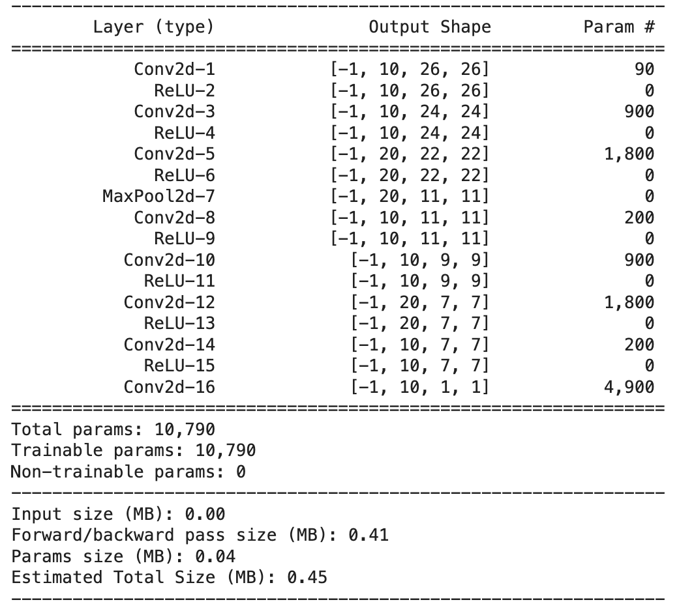
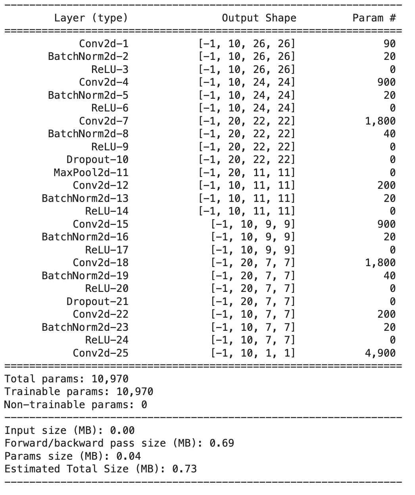

## Session 7 Assignment -
**********************************************************************************************************************
### Model1 Name - The Lighter Model
### Code Explanation

#### Target 
Make the model lighter

#### Results: 
1.Parameters : 10790

2.Train Accuracy : 99.11

3.Test Accuracy : 98.90
  
#### Analysis:
1.Good model!
  
2.No over-fitting
  
#### File Link: https://github.com/ishwarraja/SOAI-ERAV2/blob/main/S7/ERA1S7F3.ipynb

**********************************************************************************************************************
### Model2 Name - The Batch Normalization
### Code Explanation

#### Target 
Add Batch-norm to increase model efficiency.

#### Results: 
1.Parameters : 10970

2.Train Accuracy : 99.29

3.Test Accuracy : 99.04

#### Analysis:
Good model!

#### File Link: https://github.com/ishwarraja/SOAI-ERAV2/blob/main/S7/ERA1S7F5.ipynb

**********************************************************************************************************************
### Model3 Name - 
### Code Explanation

#### Target 
Add Batch-norm to increase model efficiency.

#### Results: 
1.Parameters : 

2.Train Accuracy : 

3.Test Accuracy : 

#### Analysis:
Good model!

#### File Link: 

**********************************************************************************************************************
### Model4 Name - 
### Code Explanation

#### Target 
Add Batch-norm to increase model efficiency.

#### Results: 
1.Parameters : 

2.Train Accuracy : 

3.Test Accuracy : 

#### Analysis:
Good model!

#### File Link: 
