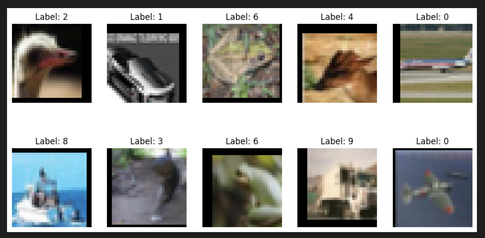

# CIFAR-10 Image Classification with PyTorch and Albumentations

This repository contains code for a deep learning image classification model based on the CIFAR-10 dataset. The model is implemented using PyTorch and incorporates Albumentations for data augmentation.

## Requirements

- Python 3.x
- PyTorch
- torchvision
- Albumentations
- Matplotlib

You can install the required libraries using `pip`:

```bash
pip install torch torchvision albumentations matplotlib
```

## Dataset

The CIFAR-10 dataset is used for training and testing the model. The dataset consists of 60,000 32x32 color images in 10 classes, with 6,000 images per class. The classes are: airplane, automobile, bird, cat, deer, dog, frog, horse, ship, and truck.

## Model Architecture

The model architecture is defined in the `Net` class. It consists of multiple convolutional layers with dilated depthwise separable convolutions. The final layer is a global average pooling layer followed by a fully connected layer to predict the class labels.

## Data Augmentation

Data augmentation is performed using the Albumentations library. The following transformations are applied to the training data:

- Random horizontal flip
- Random shift, scale, and rotation
- Coarse dropout
- ToTensor transformation

## Random image




## Training and Testing

The model is trained using Stochastic Gradient Descent (SGD) with momentum and weight decay. The loss function used is CrossEntropyLoss.

The training loop is run for a specified number of epochs, and the model's performance is evaluated on the test set after each epoch.

## Usage

1. Download the CIFAR-10 dataset:
   - The dataset will be automatically downloaded when running the code for the first time.

2. Run the code:
   - The code can be executed in a Jupyter Notebook or as a Python script.

3. Observe the training progress and test accuracy:
   - During training, statistics on loss and accuracy are displayed after each epoch.
   - After training, the final test accuracy is printed.

## Parameter


## Results

The goal of this project is to achieve a test accuracy of 85% or higher on the CIFAR-10 dataset. You can experiment with hyperparameters and model architectures to improve the performance.


## Acknowledgments

- The model architecture and training pipeline are inspired by various research papers and online tutorials.
- Albumentations library is used for data augmentation, contributing to better generalization of the model.

## Author

Ishwar

---
